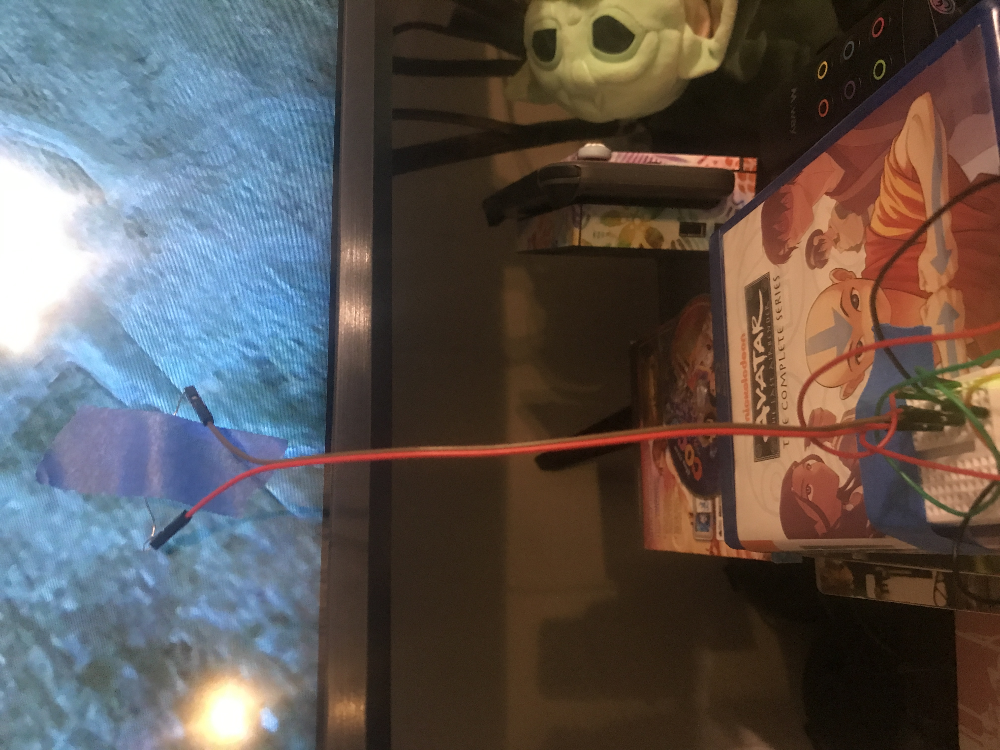

## Description

Avoid lightning strikes on Final Fantasy X by using an Arduino + LDR + Servo

Now with actual servo code! I still used the hardware shema below though, just on an ELEGOO UNO, not an Arduino pro, which is why there's more wires. I ain't fancy. 

If you're completely new to Arduino, like me, I recommend getting this kit: [ELEGOO UNO Project Super Starter Kit with Tutorial and UNO R3 Compatible with Arduino IDE](https://smile.amazon.com/gp/product/B01D8KOZF4) It has everything you need and a lot more!

```
Parts list:

1x Arduino/ELEGOO UNO R3
1x mini (or large, whatever) breadboard
1x 5V mini servo
1x LDR/photocell
1x 1kOhm resistor (or 100Ohm?, i dont care, 1k worked for me)

1x USB connector for arduino
5x M to M wires 
2x M to F wires (to lead sensor to TV)

masking/painters tape for photocell -> TV
rubber bands for servo -> controller
```




## Hardware schema

Download [fritzing schema](https://github.com/rephus/lightning-dodge-O-matic/raw/master/schema.fzz)


```
LDR + -> A0
LDR - -> 5V
1kOhm + -> GND
1kOhm - ->  A0
Servo - -> GND
Servo + -> 5V
Servo i -> D9
```
