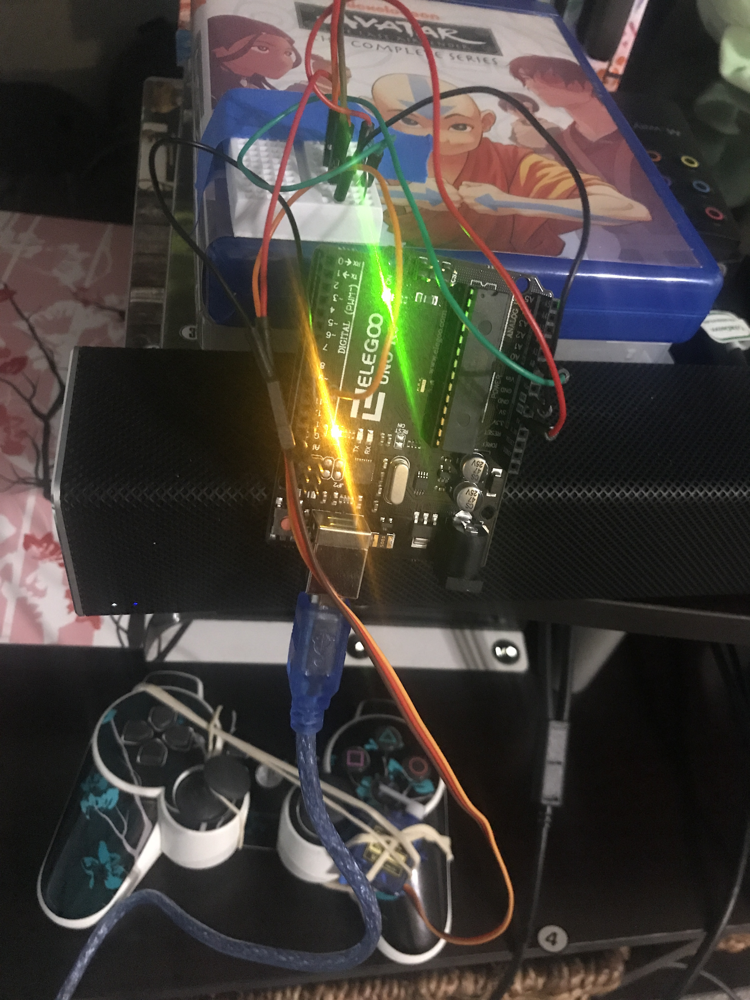

## Description

Avoid lightning strikes on Final Fantasy X by using an Arduino + LDR + Servo


Now with actual servo code! I still used the hardware shema below though, just on an Arduino UNO, not a pro, which is why there's more wires.

```
Parts list:

Arduino/ELEGOO UNO R3
mini breadboard
5V servo
LDR/photocell

USB connector for arduino
M to M wires x5
M to F wires x2 (to lead sensor to TV)
```



## Hardware schema

Download [fritzing schema](https://github.com/rephus/lightning-dodge-O-matic/raw/master/schema.fzz)


```
LDR + -> A0
LDR - -> 5V
110Ohm + -> GND
110Ohm - ->  A0
Servo - -> GND
Servo + -> 5V
Servo i -> D9
```
